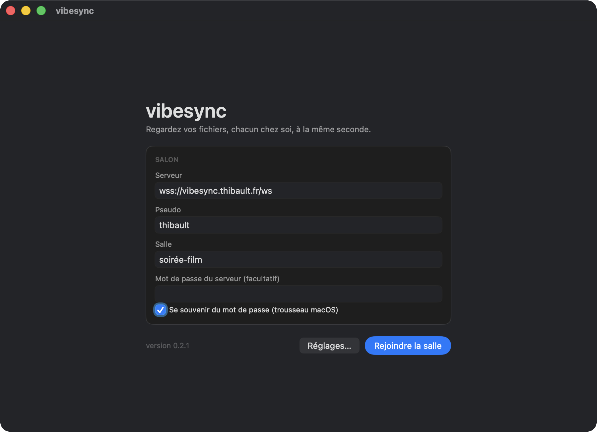
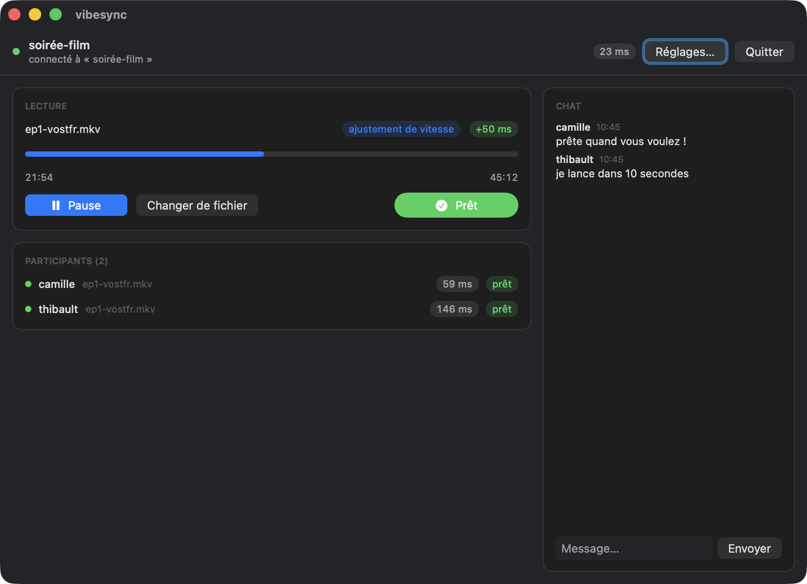

# Guide vibesync — macOS

Pour regarder un film en même temps que tes potes, chacun de son côté, avec VLC
qui reste calé sur la même image chez tout le monde.

## Ce qu'il te faut

- Un **Mac Apple Silicon** (M1 ou plus récent).
- **VLC** installé dans `/Applications` (le vrai, [videolan.org](https://www.videolan.org/vlc/))
  — vibesync ne lit rien lui-même, il pilote ton VLC.
- Le fichier vidéo, en local sur ton Mac. Chacun a sa propre copie ; vibesync
  n'envoie jamais le fichier à personne.
- L'adresse du serveur (donnée par la personne qui l'héberge), un pseudo, et le
  nom de la salle à rejoindre — mets-vous d'accord dessus avant.

## Installation

1. Va sur la page des versions :
   `https://github.com/opmvpc/vibesync/releases/latest`
   *(lien à confirmer par la personne qui t'a envoyé ce guide)*.
2. Dans la section **Assets**, télécharge le fichier qui finit par
   **`-macos-arm64.zip`**, du genre **`VibeSync-0.2.3-macos-arm64.zip`** (le
   numéro de version est dans le nom, il change à chaque nouvelle version).
   C'est celui pour Mac ; le `.exe` à côté, c'est la version Windows, elle ne
   te sert à rien.
3. Double-clique le `.zip` dans ton dossier **Téléchargements** : il se
   décompresse et te laisse **VibeSync.app**.
4. Glisse **VibeSync.app** dans ton dossier **Applications** — pas
   obligatoire, mais tu la retrouveras plus facilement la prochaine fois.

## Le premier lancement (à faire une seule fois)

L'app est bricolée à la maison : elle n'est pas signée par un compte
développeur Apple. macOS se méfie donc au tout premier lancement, et **un
simple double-clic sera refusé**. C'est normal, et il y a deux façons de lui
dire « oui, je sais ce que je fais ». Essaie la première ; si ton Mac est
récent (macOS Sequoia ou plus), ce sera la seconde.

**Méthode 1 — clic droit → Ouvrir**

1. **Clic droit** (ou Ctrl + clic) sur **VibeSync.app** → **Ouvrir** dans le
   menu qui apparaît.
2. Une fenêtre prévient que l'éditeur n'est pas identifié : clique le bouton
   **Ouvrir**.

**Méthode 2 — passer par les Réglages Système**

Si le menu ne propose pas d'**Ouvrir**, ou si le message refuse l'app sans te
laisser le choix :

1. Double-clique **VibeSync.app** une première fois et laisse macOS refuser
   (c'est cet essai qui déclenche la suite).
2. Ouvre le menu  → **Réglages Système** → **Confidentialité et sécurité**.
3. Descends jusqu'à la section **Sécurité** : une ligne mentionne VibeSync.
   Clique **Ouvrir quand même**.
4. Confirme (mot de passe ou Touch ID si ton Mac le demande), puis clique
   **Ouvrir** dans la dernière fenêtre.

Dans les deux cas, c'est à faire **une seule fois** : ensuite, VibeSync
s'ouvre d'un simple double-clic comme n'importe quelle autre app.



## Rejoindre une salle

1. Au lancement, renseigne :
   - **Serveur** : l'adresse donnée par ton hôte (ex. `wss://vibesync.exemple.com/ws`)
   - **Pseudo** : ton nom, tel que les autres le verront
   - **Salle** : le nom convenu avec tes amis (invente-le, la salle se crée
     toute seule si elle n'existe pas encore)
2. Valide. Ces infos sont mémorisées (préférences macOS) : tu n'auras plus à
   les retaper la prochaine fois.



3. Une fois dans la salle, clique **Ouvrir un fichier...** et choisis ta vidéo.
   VLC se lance tout seul, en pause, prêt à démarrer.
4. Quand tu es prêt, clique **Je suis prêt**. La lecture ne démarre que quand
   **tout le monde** a cliqué ce bouton.
5. À partir de là, c'est automatique : play, pause, avance/recul décidés par
   n'importe qui dans la salle se répercutent chez tout le monde. Un petit
   indicateur montre l'écart (drift) entre ton VLC et la salle.

## Dépannage

**« VibeSync.app est endommagée et ne peut pas être ouverte »** (au lieu du
message Gatekeeper normal) — commence par redézipper l'archive avec le
décompresseur intégré de macOS (double-clic sur le `.zip`) : certains outils
tiers (The Unarchiver, WinZip...) abîment l'app en la décompressant. Si le
message persiste, dans le Terminal :

```sh
xattr -dr com.apple.quarantine /Applications/VibeSync.app
```

puis relance normalement (clic droit → Ouvrir si besoin).

**« VLC introuvable »** — vibesync cherche VLC dans `/Applications/VLC.app`
(et quelques autres emplacements habituels). Deux solutions :
- installer VLC normalement à cet emplacement si ce n'est pas déjà fait ;
- si VLC est ailleurs : **Réglages… → VLC → Parcourir…**, et sélectionne
  `VLC.app` (ou directement le binaire `vlc`). La ligne sous le champ te dit
  tout de suite si le chemin est bon. Vider le champ revient à la détection
  automatique.

  Pour un lancement scripté, la variable d'environnement `VIBESYNC_VLC` marche
  toujours — le réglage de l'app, lui, passe devant :
  ```sh
  VIBESYNC_VLC=/chemin/vers/VLC.app open /Applications/VibeSync.app
  ```

**« Fichiers différents entre amis »** (toast d'avertissement) — le serveur
compare la durée des fichiers déclarés par chacun. Si elles diffèrent de plus
de 2 secondes, tu reçois un avertissement (pas un blocage) : vérifiez que vous
avez bien la même version/coupe du fichier, sinon la sync sera approximative
en fin de vidéo.

**Désync persistante** — le moteur corrige en douceur les petits écarts
(vitesse légèrement ajustée le temps de rattraper) et fait un saut direct pour
les gros écarts. Si ça ne se résorbe jamais :
- vérifie ta connexion réseau (une latence très instable perturbe l'estimation
  d'horloge) ;
- vérifie que ton fichier est exactement la même version que celle des autres
  (voir point précédent) ;
- une coupure réseau de quelques secondes se répare toute seule (reconnexion
  automatique) ; au-delà, rejoins à nouveau la salle avec le même pseudo, ta
  place est reprise proprement.
