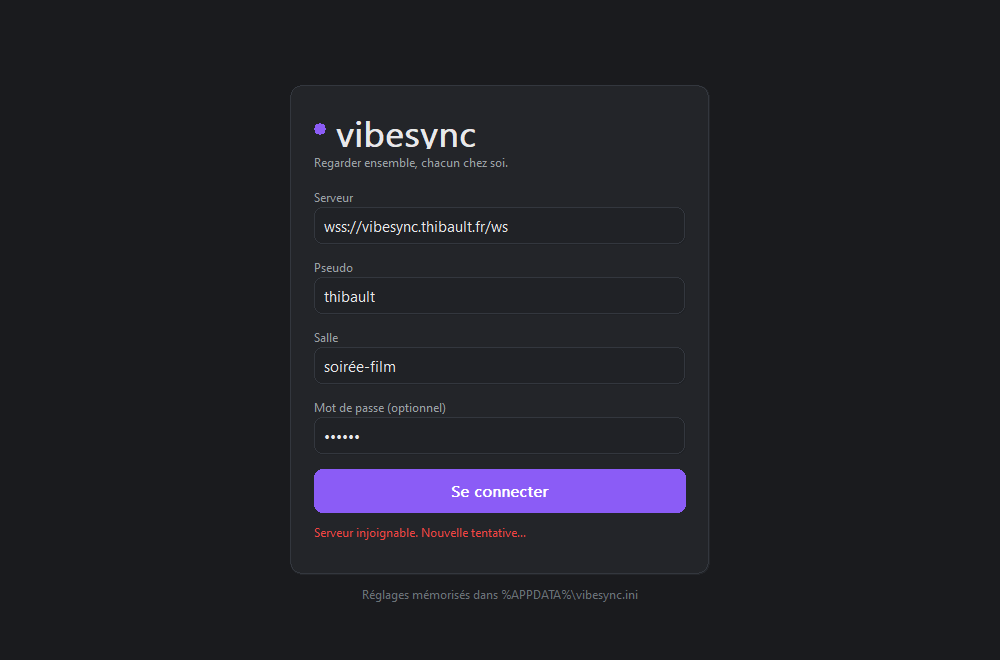
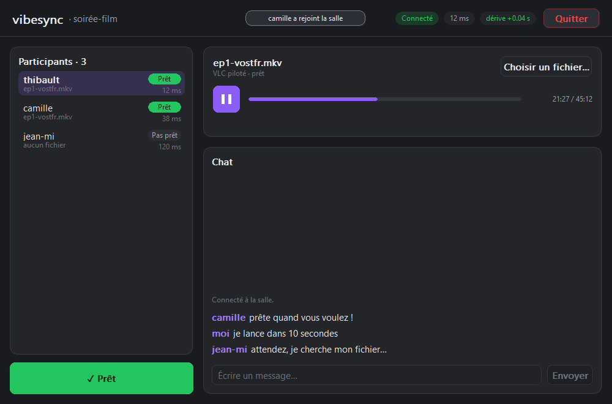

# Guide vibesync — Windows

Pour regarder un film en même temps que tes potes, chacun de son côté, avec VLC
qui reste calé sur la même image chez tout le monde.

## Ce qu'il te faut

- **VLC** installé (le vrai, [videolan.org](https://www.videolan.org/vlc/)) —
  vibesync ne lit rien lui-même, il pilote ton VLC.
- Le fichier vidéo, en local sur ton PC. Chacun a sa propre copie ; vibesync
  n'envoie jamais le fichier à personne.
- L'adresse du serveur (donnée par la personne qui l'héberge), un pseudo, et le
  nom de la salle à rejoindre — mets-vous d'accord dessus avant.

## Installation

1. Télécharge `vibesync.exe` depuis les releases GitHub :
   `https://github.com/opmvpc/vibesync/releases/latest` *(lien à confirmer par
   la personne qui t'a envoyé ce guide)*.
2. Pas d'installateur : c'est un seul fichier `.exe` (moins de 500 Ko). Mets-le
   où tu veux (Bureau, Documents...) et double-clique dessus.

## Rejoindre une salle

1. Au lancement, renseigne :
   - **Serveur** : l'adresse donnée par ton hôte (ex. `wss://vibesync.exemple.com/ws`)
   - **Pseudo** : ton nom, tel que les autres le verront
   - **Salle** : le nom convenu avec tes amis (invente-le, la salle se crée
     toute seule si elle n'existe pas encore)
2. Valide. Ces infos sont mémorisées : tu n'auras plus à les retaper la
   prochaine fois.

3. Une fois dans la salle, clique **Ouvrir un fichier...** et choisis ta vidéo.
   VLC se lance tout seul, en pause, prêt à démarrer.
4. Quand tu es prêt, clique **Je suis prêt**. La lecture ne démarre que quand
   **tout le monde** a cliqué ce bouton.
5. À partir de là, c'est automatique : play, pause, avance/recul décidés par
   n'importe qui dans la salle se répercutent chez tout le monde. Un petit
   indicateur montre l'écart (drift) entre ton VLC et la salle.

## Dépannage

**Windows affiche un avertissement au premier lancement** (SmartScreen,
« Windows a protégé votre ordinateur », ou une demande du pare-feu) — normal,
`vibesync.exe` n'est pas signé numériquement. Clique **Informations
complémentaires** puis **Exécuter quand même** (SmartScreen), et **Autoriser
l'accès** si le pare-feu demande une confirmation réseau.

**« VLC introuvable »** — vibesync cherche VLC aux emplacements habituels
(`Program Files`). Deux solutions :
- installer VLC normalement si ce n'est pas déjà fait ;
- si VLC est ailleurs (installation portable, autre disque), définir la
  variable d'environnement `VIBESYNC_VLC` avec le chemin complet vers
  `vlc.exe`, puis relancer `vibesync.exe`.

**« Fichiers différents entre amis »** (toast d'avertissement) — le serveur
compare la durée des fichiers déclarés par chacun. Si elles diffèrent de plus
de 2 secondes, tu reçois un avertissement (pas un blocage) : vérifiez que vous
avez bien la même version/coupe du fichier, sinon la sync sera approximative
en fin de vidéo.

**Désync persistante** — le moteur corrige en douceur les petits écarts
(vitesse légèrement ajustée le temps de rattraper) et fait un saut direct pour
les gros écarts. Si ça ne se résorbe jamais :
- vérifie ta connexion réseau (une latence très instable perturbe l'estimation
  d'horloge) ;
- vérifie que ton fichier est exactement la même version que celle des autres
  (voir point précédent) ;
- une coupure réseau de quelques secondes se répare toute seule (reconnexion
  automatique) ; au-delà, rejoins à nouveau la salle avec le même pseudo, ta
  place est reprise proprement.
